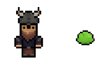
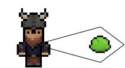
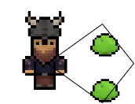
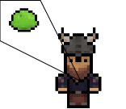
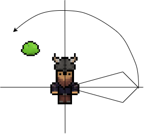
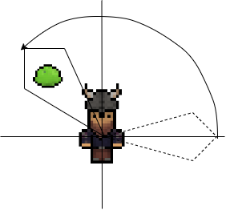
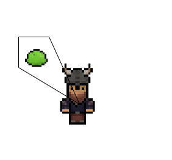

Ishjarta - Doku
===============

Das soll eine Dokumentation des Projekts Ishjarta sein, welche die verschiedenen Komponenten des Spiels in Zweck und Umsetzung erklärt.

____________
## Inhaltsverzeichnis
1. [Entitäten](#entitäten) 
    1. [Gegner](#gegner)
    2. [Spieler](#spieler)
2. [Items](#items)
     1. [Passive Items](#passive-items)
     2. [Active Items](#active-item)
     3. [Usable Items](#usable-items)
3. [Spielerbewegung](#spielerbewegung)  
4. [Entitätenangriff](#entitätenangriff)
    1. [Nahkampf](#nahkampf)
    2. [Fernkampf](#fernkampf)
5. [Inventarsystem und Item-Pick-Ups des Spielers](#inventarsystem-und-item-Pick-Ups-des-Spielers) 
6. [Statuseffektsystem](#statuseffektsystem)  
7. [Statuseffektsystem](#statuseffektsystem)
8. [Speichersystem](#speichersystem)
9. [Speichersystem](#speichersystem)
10. [Raumgeneration](#raumgeneration)

## Entitäten

Es exisistieren zwei Kategorien von Entitäten:
- Gegner
- Spieler

### Gegner

Es existieren zwei Kategorien von Gegner:
- Nahkampf
- Fernkampf

#### Nahkampf

Nahkampf-Gegner verursachen dem Spieler schaden in dem Sie sich zum Spieler zu bewegen.

#### Fernkampf

Fernkampf-Gegner verursachen dem Spieler schaden in dem Sie Projektile auf den Gegner schießen.

### Spieler

Der Spieler ist in der Lage dem Gegner Nachkampf- und Fernkampfschaden zuzufügen.

## Items

Es existieren drei Kategorien von Items:
- Passive Items
- Active Items
- Usable Items

### Passive Items

Passive Items sind Items, die dem Spieler passiv bestimmte Effekte verleihen können. Von dieser Art von Item kann der Spieler praktisch unendlich viele halten.

### Active Items

Active Items sind Items, die dem Spieler nur bestimmte Effekte verleihen können, wenn er dieses Item auch aktiviert. Von dieser Art von Item kann der Spieler nur maximal eins halten.

### Usable Items

Es gibt vier verschiedene Kategorien von Usable Items:
- Key
- Coin
- Bomb
- Armor

Usable Items sind Items, die der Spieler während des Gameplays für bestimmte Tätigkeiten nutzen kann.

## Spielerbewegung

Die Spielerbewegung soll dem Spieler ermöglichen, den Spielercharakter bewegen zu können.

Bewegen kann sich der Spieler mit den Pfeiltasten.

Ermöglicht wird die Spielerbewegung durch die Move-Methode im Playercontroller-Script.

## Entitätenangriff

### Nahkampf

Der Nahkampf ermöglicht es dem Spieler dem Gegner von der Nähe schaden zuzufügen.
Die Funktionsweise des Nahkampfs erfolgt dadurch, dass vor dem Spieler für eine sehr kurze Zeit ein Kollisionsfeld aufgebaut wird und alle Gegner die sich in diesem Feld befinden schaden zugefügt bekommen.
Die Größe vom Feld wird von der Angriffsreichweite und Angriffsweite der Nahkampfwaffe bestimmt.

Diese Funktionsweise ermöglicht es dem Spieler, bei einer dementsprechenden Angriffsweite der Nahkampfwaffe, mehreren Gegnern Flächenschaden zuzufügen.

Der Nachteil dieser Funktionsweise ist das Berechnen der Eckpunkte des Kollisionsfeld. Da sich das Kollisionsfeld nach der Angriffsrichtung ausrichtet und die Eckpunkte mit Koordinaten angegeben werden müssen, ist das berechnen der Eckpunktskoordinaten besonders schwer.

Zum Berechnen der Eckpunktskoordinaten wird folgender Lösungsweg benützt:

Das Kollsionsfeld wird auf der X-Achse aufgebaut, da man die Angriffsreichweite und Angriffsweite da relativ gut als Koordinaten darstellen kann.
Danach wird der Winkel zwischen der X-Achse und dem Gegner berechnet, was auch relativ einfach ist (siehe code).
Zum Ende werden die Eckpunktkoordinaten um diesen bestimmten Winkel um den Ursprung rotiert und man bekommt das fertige Kollisionsfeld um den Gegner.

### Fernkampf

## Inventarsystem und Item-Pick-Ups des Spielers

## Statuseffektsystem

## Speichersystem

## Raumgeneration